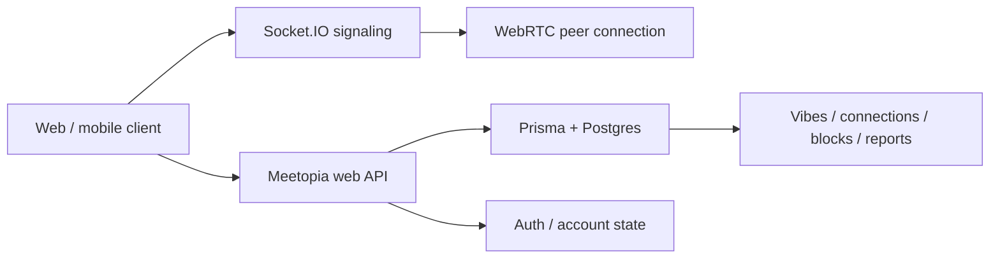

# Meetopia

<!-- repo-intro:start -->
**Project snapshot:** Meetopia is a conversation-first adult social/dating product built around live video Chemistry Checks. People talk first, then save a connection only when both choose to Vibe.

**What it demonstrates:** Next.js · React Native / Expo · WebRTC · Socket.IO · Prisma/Postgres · Supabase-backed production data · mobile release tooling · real-time product security.
<!-- repo-intro:end -->

> **Talk first. Vibe after.**

**Web:** https://meetopia-live.netlify.app  
**Signaling:** https://meetopia-signaling-v2.onrender.com

Meetopia removes the long-profile/swipe-first loop from online dating. Two adults enter a live **Chemistry Check**, meet face-to-face, and decide for themselves whether the conversation is worth continuing.

A saved **Connection** is created only when both people Vibe.

## Product flow

1. Create an account or sign in.
2. Confirm that you are 18 or older.
3. Allow camera and microphone access.
4. Enter the matching queue.
5. Meet another available user in a live Chemistry Check.
6. Talk, chat, mute, flip cameras, go fullscreen, report, block, leave, or move to the next person.
7. Tap **Vibe** if you want to keep the connection.
8. The connection is saved only after a mutual Vibe.

## Why this project is technically interesting

Meetopia is not a static social UI. It coordinates identity, matchmaking, real-time signaling, peer-to-peer media, moderation, connection state, and cross-platform clients.



The product deliberately separates **media transport** from **product authority**:

- WebRTC carries peer-to-peer audio/video.
- Socket.IO coordinates signaling and live session events.
- Server-side application logic controls authenticated access to product data.
- Prisma/Postgres stores durable social state such as users, Vibes, Connections, blocks, and reports.
- A shared signaling-auth boundary prevents the real-time layer from becoming an unauthenticated side door.

## Core features

### Live Chemistry Checks

- random two-person matching
- WebRTC audio/video
- Socket.IO signaling
- in-call text chat
- typing/read-state support
- mute/camera controls
- front/rear camera switching
- fullscreen presentation
- leave / next-person flow
- STUN/TURN fallback configuration

### Connection model

- one-sided Vibes remain private intent
- a saved Connection requires mutual Vibe
- existing connections persist beyond the call
- connection access is validated server-side

### Trust and safety

- 18+ confirmation
- block flow
- report flow
- authenticated real-time access
- production-only signaling secret boundary
- privacy, terms, community-guideline, and support surfaces
- App Store privacy/review documentation tracked in-repo

### Cross-platform delivery

This repository contains both:

- the **Next.js web product**
- an **Expo / React Native mobile client** under `apps/mobile`

The mobile client uses Expo Router, React Native WebRTC, Socket.IO, EAS configuration, native iOS project files, and App Store/TestFlight QA documentation.

## Tech stack

| Layer | Technology |
| --- | --- |
| Web | Next.js 16, React 19, Tailwind CSS |
| Mobile | Expo, React Native, Expo Router |
| Video | WebRTC / react-native-webrtc |
| Signaling | Socket.IO + Express |
| Data access | Prisma |
| Database | PostgreSQL / Supabase project |
| Auth/product state | production web API + database-backed identity |
| Web hosting | Netlify |
| Signaling hosting | Render |
| Mobile delivery | EAS / iOS build pipeline |

## Repository structure

```text
src/              Next.js web product
server/           Socket.IO signaling service
prisma/           schema + data layer
apps/mobile/      Expo / React Native mobile client
docs/             deployment, App Store, QA, privacy, security notes
public/           web assets
```

## Local development

Install the web dependencies:

```bash
npm install
```

Run the web app and signaling server together:

```bash
npm run dev
```

Or separately:

```bash
npm run dev:next
npm run dev:server
```

The local web app defaults to `http://localhost:3000`; the local signaling server defaults to `http://localhost:3003`.

Environment variables are documented in `.env.example` and `server/.env.example`.

### Mobile

```bash
cd apps/mobile
npm install
npm run ios
```

The native client requires a development build for WebRTC functionality.

## Production source of truth

- branch: `main`
- web: `meetopia-live` on Netlify
- signaling: `meetopia-signaling-v2` on Render
- mobile: `apps/mobile`
- database: dedicated Meetopia production project
- Vercel is not part of the production deployment path

Legacy explicit-room WebRTC experiments, public camera-test routes, component showcases, and abandoned Feed/Explore prototypes have been removed from the production path.

## Product principle

Meetopia is intentionally profile-light and conversation-heavy.

**The conversation is the profile.**
